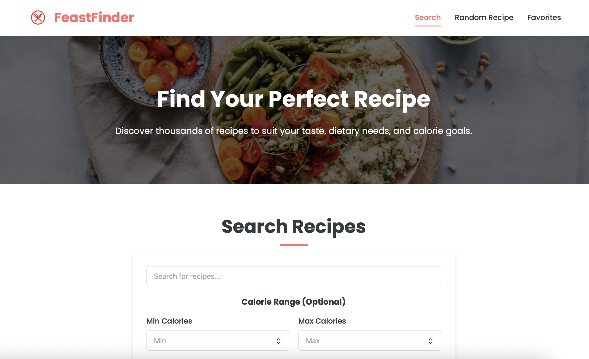

# FeastFinder - Your Guide to Gastronomic Greatness



## Brief description of the project

We are group 101 and this is our app called `FeastFinder`, an interactive cooking website that lets users search for recipes by keyword or by the ingredients they already have, narrow those results with minimum and maximum calorie filters, and open recipe cards that display photos, nutritional facts, ingredients, step-by-step instructions, and a clear price breakdown. After finding or creating a dish they like, they can save it to their favorites, update the instructions, delete it later, and even browse their saved recipes by title or ingredient. A random recipe button offers instant inspiration, while an on-screen cooking timer keeps the preparation on track in real time. We left styling decisions entirely to the GenAI tools, setting no visual rules as the front-end took shape.

## Team members

**Márton Bodó**

## Installation details

### Prerequisites:

- Ensure you have all dependencies installed. These are listed in a file named `requirements.txt`. You can install them using `pip install -r requirements.txt`.

### Starting the server:

1. Open a terminal window.
2. In that terminal, navigate to the back-end server directory using `cd` followed by the path.
3. Then, run `python3 app.py` to start the `FeasFinder` Flask server.

### Accessing the servers:

Once the server is running, you should be able to access it using the provided port number.


## Project Structure

Below is an overview of the folder structure for this project. It’s organized to separate backend, frontend, configuration files, and tests clearly.

```plaintext
AP-EXAMPLE-PROJECT/                  # Root directory of the project
├── .github/                         # GitHub workflows and configurations
├── back-end/                        # Backend source code
│   ├── __pycache__/                 # Python cache files
│   ├── .pytest_cache/               # Pytest cache for faster test runs
│   ├── feast_finder/                # Main backend app package
│   │   ├── __pycache__/             # Cache for the package
│   │   ├── __init__.py              # Marks as a Python package
│   │   ├── feast_finder.py          # FeasFinder classs
│   │   ├── util.py                  # Utility functions
│   └── tests/                       # Backend test suite
│       ├── __pycache__/             # Cache for tests
│       ├── .pytest_cache/           # Test run cache
│       ├── context.py               # Test setup and fixtures
│       ├── test_app.py              # Tests for main app logic
│       ├── test_crud.py             # Tests for CRUD operations
│       └── test_favorites_crud.py   # Tests for favorites CRUD
├── .env                             # Environment variables
├── app.py                           # Back-end Flask server
├── myfavrecipes.json                # Favorite recipes
├── requirements.txt                 # Python package dependencies
├── front-end/                       
├── genai-front-end/                 # Main frontend application
│   ├── static/                      # Static assets (CSS, JS, images)
│   │   ├── css/
│   │   │   └── styles.css           # Stylesheet
│   │   ├── images/
│   │   │   ├── logo.png             # Logo image
│   │   │   └── temp.png             # Placeholder image (for missing images)
│   │   └── js/
│   │       └── scripts.js           # Frontend JavaScript
│   └── templates/
│       └── index.html               # HTML template
├── .gitignore                       # Specifies files to ignore in Git
├── LICENSE                          # Project license information
├── README.md                        # Project overview and instructions
└── requirements.md                  # App requirements
└── app-photo.png                    # Website design demo
```


## Requirements

For the requirements of this project, see [requirements](requirements.md).